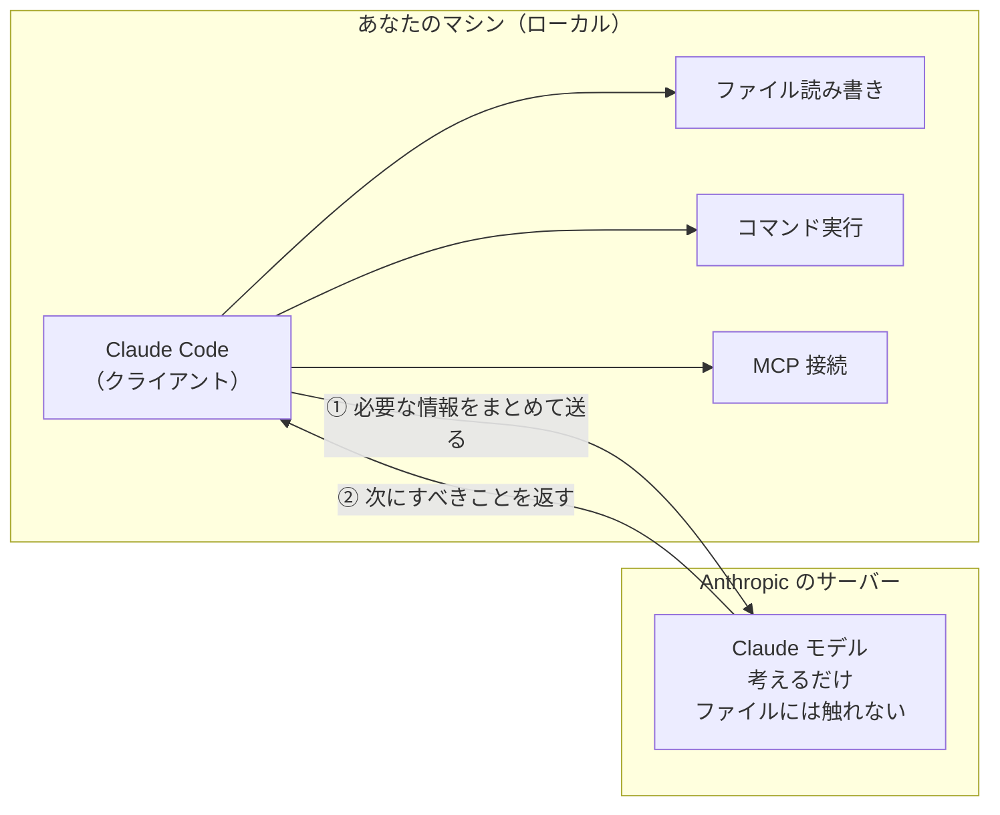

## 📊 [フルカラー版（図解つき）はこちら](https://chips-pengpeng.ssl-lolipop.jp/zenn/overview/claude-code-overview.html)

> 色分け・構成図つきの完全版を別サイトに置いています。構造を掴むならこちらの方が速いです。


*フルカラー版の画面*

:::message
**検証環境：Claude Code v2.1.232 / 2026-08 時点**
仕様の更新が速い領域です。重要な判断の前には公式ドキュメントで再確認してください。
:::

`.claude/` フォルダの中身と、設定が競合したときの優先順位。そして**導入を決める前に知っておくべき弱点**まで。公式ドキュメントと実機で照合した内容をまとめます。

PM にも新人にも読めるように書いていますが、内容は仕様ベースです。

---

## そもそも Claude Code とは？

Claude Code は**自分のマシンで動くクライアントアプリ**で、中にモデルは入っていません。判断が必要になるたびに Anthropic のサーバーへ問い合わせ、返ってきた指示に従ってローカルで作業します。

以降の設定の話は、すべてこの往復のどこかに効いています。



**③ 実行はすべてローカル側**で行われます。権限チェックをしながら Hooks が発火するのもここ。
**④ 結果を足して、また ① へ。** これを完了まで繰り返します。

1 回の依頼で、この往復は何度も起きます。「ファイルを読む → 内容を見て次を決める → 修正する」という手順そのものが、①〜④ の繰り返しとして進みます。

### 押さえるべき 3 点

| | |
|---|---|
| **モデルは何も実行できない** | ファイルを開く、コマンドを走らせる、外部サービスに繋ぐ。すべてローカルのクライアントの仕事で、モデルが返すのは「次にこれをして」という指示だけ |
| **毎回、必要な情報を送り直している** | 設定ファイルの中身も会話の履歴も、その都度クライアントが集めて送信する。何を送るかを決めているのが、この記事で扱う設定群 |
| **だから安全柵はローカルに置く** | 権限設定と Hooks はクライアント側で判定される。モデルの判断を通らないので、「守ってくれるはず」ではなく確実に効く |

---

## このページの登場人物

後続の構成図に出てくるファイルとフォルダの一覧です。

| 登場人物 | ひとことで言うと | 置かれる階層 |
|---|---|---|
| `CLAUDE.md` | 「このプロジェクトはこういうものだ」を書いた取扱説明書。毎回まるごと読まれる | 両方 |
| `CLAUDE.local.md` | 同じものの個人版。共有したくない前提や好みを書く | プロジェクト |
| `settings.json` | 権限・モデル・Hooks など、**動作そのもの**を決める設定ファイル | 両方 |
| `settings.local.json` | 上の個人上書き。秘密や自分の環境固有の許可をここに分離する | プロジェクト |
| `rules/` | 分野ごとの詳しい決まりごと。`paths` で**適用対象ファイル**を絞れる | 両方 |
| `skills/` | 繰り返す作業の手順書。`/名前` で呼べて、Claude が自分で使うこともある | 両方 |
| `agents/` | 別のコンテキストで働く専門役。任せると**結果だけ**返してくる | 両方 |
| `commands/` | skills 以前のカスタムスラッシュコマンド。今は**レガシー** | プロジェクト |
| `plugins/` | skills・agents・hooks・MCP をまとめて配れるようにしたセット | ユーザー |
| `.mcp.json` / `~/.claude.json` | 外部サービスへの接続設定。Claude に手足を与える | 両方 |
| `projects/<project>/memory/` | **Claude が自分で書き溜める作業メモ。**人間が置くものではない | ユーザー |

---

## 構成フォルダやファイルの様子

設定は **2 つの階層**に分かれて置かれます。全プロジェクトに効く**ユーザー階層**と、リポジトリごとの**プロジェクト階層**。同じ名前のものが両方に存在することがあり、そのときどちらが勝つかは後半で扱います。

以下のツリーでは記号で区別しています。

| 記号 | 意味 |
|---|---|
| 🟢 | Git でチームに共有される |
| 🟠 | 自分だけ（Git 対象外） |
| 🔵 | Claude が自動で書く |

### ユーザー階層 `~/.claude/`

全プロジェクトに効く個人の設定。マシンローカルで、Git には入りません。

```text
~/.claude/
├── 🟠 CLAUDE.md                     全プロジェクト共通の個人指示。毎セッション全文が読み込まれる
├── 🟠 settings.json                 個人設定。権限・モデル・Hooks はすべてこの中（フォルダではない）
├── 🟠 rules/                        個人ルール ※paths: による絞り込みはこの階層では効きにくい
├── 🟠 skills/<name>/SKILL.md        個人スキル。/name の手動起動と自動起動の両方に対応
├── 🟠 agents/*.md                   個人サブエージェント。独立したコンテキストで動き、結果だけ返す
├── 🟠 plugins/                      スキル・フック・エージェント・MCP をまとめた配布単位
└── 🔵 projects/<project>/memory/    ★自動メモリ。プロジェクト内ではなくここに置かれる
    ├── 🔵 MEMORY.md                 索引。毎セッション、先頭 200 行 / 25KB まで読み込まれる
    └── 🔵 *.md                      トピック別の詳細。必要になった時だけ読まれる

~/.claude.json                       MCP サーバー設定（ユーザースコープ）／OAuth／キャッシュ
                                     ※ .claude/ の外にある
```

### プロジェクト階層

リポジトリごとの設定。**ここだけが Git に乗り**、チームで共有されます。同名のものはユーザー階層より優先されます。

```text
your-project/
├── 🟢 CLAUDE.md                     プロジェクトの地図と規約。.claude/CLAUDE.md でも可。200 行以下が目安
├── 🟠 CLAUDE.local.md               自分だけのプロジェクト用メモ。CLAUDE.md と一緒に読まれる
├── 🟢 .mcp.json                     MCP のプロジェクトスコープ設定 ※.claude/ の外にある
└── .claude/
    ├── 🟢 settings.json             チーム共有の設定。権限・Hooks・モデルはこの中
    ├── 🟠 settings.local.json       個人の上書き。秘密や環境固有の許可はここへ分離する
    ├── 🟢 rules/*.md                paths: で対象ファイルを絞れる。一致した時だけ読まれる
    ├── 🟢 skills/<name>/SKILL.md    繰り返す手順。フォルダ＋SKILL.md 1 枚が最小構成
    ├── 🟢 agents/*.md               サブエージェント定義。tools を絞って最小権限にする
    └──    commands/*.md             旧形式のスラッシュコマンド。動くが非推奨（レガシー）
```

---

## `settings.json` って何？

**Hooks・権限・モデル**の指定には専用フォルダがありません。すべて `settings.json` のキーとして書きます。ここを見落とすと全体像が繋がりません。

ユーザー / プロジェクト / ローカルのどの階層にも同じキーを書けます。

### `permissions`

```json
"permissions": {
  "deny":  ["Read(./.env)", "Bash(rm -rf *)"],
  "allow": ["Bash(npm run test:*)"]
}
```

`allow` / `deny` / `ask`。セキュリティの本体で、`deny` が最優先で効きます。

### `hooks`

```json
"hooks": {
  "PostToolUse": [{
    "matcher": "Edit|Write",
    "hooks": [{
      "type": "command",
      "command": "/path/to/lint-check.sh"
    }]
  }]
}
```

イベント発火の自動処理。ライフサイクルイベントで確実に走ります。

### `model` / `effortLevel`

```json
"model": "claude-sonnet-5",
"effortLevel": "high"
```

使うモデルと思考量。コストに直結します。

### `env`

```json
"env": {
  "NO_COLOR": "1",
  "CLAUDE_CODE_ENABLE_TELEMETRY": "1"
}
```

全セッションに適用される環境変数。

### `autoMemoryEnabled`

```json
"autoMemoryEnabled": false,
"autoMemoryDirectory": "~/my-memory-dir"
```

自動メモリの有効・無効と保存先の変更。

### `extraKnownMarketplaces`

```json
"extraKnownMarketplaces": {
  "my-team-tools": {
    "source": {
      "source": "github",
      "repo": "your-org/claude-plugins"
    }
  }
}
```

プラグインの配布元を登録します。個別の有効化は `enabledPlugins`。

---

## では何が、いつコンテキストに載るのか

### コンテキストとは？

**Claude Code がモデルに問い合わせるたび**、モデルは渡された文章を最初から最後まで全部読み直してから答えています。この**毎回送られる文章の全部**がコンテキストで、そこに入れられる上限がコンテキストウィンドウです。

文章を組み立てて持っているのは **Claude Code 側**で、**モデル側には何も残りません**。答え終わればモデルは全部忘れます。だから次の問い合わせでも、また最初から全部を送り直すことになります。

これは**あなたが入力した回数とは一致しません**。前の図の ①〜④ が 1 周するたびに起きるので、1 回の依頼の中で何度も繰り返されます。「ファイルを読む → 内容を見て次を決める → 修正する」で 3 往復すれば、3 回とも全部を読み直しています。

:::message
**たとえるなら、書庫と作業机。**

ディスクの中は**書庫**で、コンテキストは**作業机**にあたります。書庫にどれだけ資料を揃えても、モデルが読めるのは Claude Code が机の上に広げた分だけ。そして机の広さは決まっています。

設定ファイルを「書く」のは書庫に本を入れる作業、「読み込まれる」のは机に載せる作業。**この 2 つは別物です。**
:::

ここから 3 つの帰結が出ます。

| | |
|---|---|
| **置いてあるだけでは効かない** | 机に載って初めて動作に影響する。「ちゃんと書いたのに効かない」の多くは、そもそも読み込まれていない |
| **机は有限で、埋まると精度が落ちる** | 載せすぎると指示が他の情報に埋もれる。CLAUDE.md を短く保てと言われるのはこのため |
| **問い合わせのたびに全部読み直される** | 差分だけが流れていくのではない。しかも入力 1 回につき何往復も起きるので、常駐するものはそのたびにコストを払う |

### 読み込みタイミング一覧

設計上の要点は「机に載せっぱなしにするもの」と「必要な時だけ載せるもの」の切り分けです。フォルダ構成図では見えないのがこの部分。

| 機能 | セッション開始時 | 使用・呼び出し時 | 常駐 |
|---|---|---|---|
| **CLAUDE.md** | 全文が載る | — | ✅ 会話の終わりまで |
| **rules/（`paths` なし）** | 全文が載る | — | ✅ |
| **rules/（`paths` あり）** | 載らない | 一致するファイルを読んだ時に載る | 以降は常駐 |
| **skills/** | 説明文だけ（軽い） | 呼び出された時に本文が載る | 説明のみ |
| **MCP** | ツール名だけ | 使う時にスキーマが載る | ツール名のみ |
| **agents/** | — | 別のコンテキストで動く。戻るのは結果の要約だけ | ❌ 分離される |
| **hooks（settings 内）** | — | コンテキストの外で実行される | ❌ 消費ゼロ |

常駐するのは **CLAUDE.md と `paths` 指定のないルールだけ**。skills と MCP は「見出しだけ常駐、中身は使う時」という二段構えです。

CLAUDE.md を短く保つよう言われるのは、**ここが唯一「常に全額を払い続ける」場所**だからです。

---

## 5 レイヤーと実体の対応

概念としてのレイヤーが、ディスク上のどこに存在するのか。役割が重なって見えるときはこの表に戻ります。

| レイヤー | 実体の場所 | 役割 | 同名が複数階層にあるとき |
|---|---|---|---|
| **CLAUDE.md** | `~/.claude/CLAUDE.md`<br>`CLAUDE.md` / `CLAUDE.local.md` | プロジェクトの地図と前提。常時読み込み | **加算**：全部が同時に効く |
| **Rules** | `~/.claude/rules/`<br>`.claude/rules/*.md` | ドメイン固有の深い知識。`paths:` で絞れる | **加算**：プロジェクト側が後に読まれる |
| **Skills** | `~/.claude/skills/<name>/SKILL.md`<br>`.claude/skills/<name>/SKILL.md` | 繰り返すワークフロー | **名前で上書き**：管理 > ユーザー > プロジェクト |
| **Subagents** | `~/.claude/agents/*.md`<br>`.claude/agents/*.md` | 独立コンテキストの専門ワーカー | **名前で上書き**：管理 > CLI > プロジェクト > ユーザー |
| **MCP** | `~/.claude.json`<br>`.mcp.json` | 外部サービスとの接続 | **名前で上書き**：ローカル > プロジェクト > ユーザー |
| **Hooks** | `settings.json` の `hooks` キー | イベント発火の自動処理。強制レイヤー | **マージ**：全階層のフックが全部発火する |
| **settings** | `~/.claude/settings.json`<br>`.claude/settings.json` / `.local.json` | 権限・モデル・環境変数 | **上書き**：管理 > CLI > ローカル > プロジェクト > ユーザー |

:::message alert
**合成規則が 3 種類ある**のがこの表の要点です。

CLAUDE.md は**加算**、settings は**上書き**、Hooks は**マージ**。同じ「設定」でも振る舞いが違うので、「なぜ効かない」「なぜ二重に走る」はほぼここが原因になります。
:::

---

## Git に何を乗せるか

この線引きが、チーム共有と秘密保持を両立させる唯一の分岐点です。

**コミットする（チームの共通環境になる）**

- `CLAUDE.md`
- `.mcp.json`
- `.claude/settings.json`
- `.claude/rules/`
- `.claude/skills/`
- `.claude/agents/`

**`.gitignore` に入れる（個人と秘密を分離する）**

- `CLAUDE.local.md`
- `.claude/settings.local.json`
- ※ `~/.claude/` 配下はすべて

---

## よく見かける誤解

出回っている構成図には、実際の仕様と個人の運用ルールが混ざっているものがあります。以下は公式ドキュメントと実機で確認した差分です。

### ❌ プロジェクト内に `.claude/memory/` を作り、`decisions.md` や `known-issues.md` を置く

自動メモリの実体は **`~/.claude/projects/<project>/memory/`**。索引は `MEMORY.md` で、トピック別ファイルが並びます。プロジェクト内の `.claude/memory/` は仕様ではありません。

### ❌ `.claude/commands/` にコマンドを置き、`/project:review` のように呼ぶ

`/project:` という接頭辞は現行仕様にありません。`commands/` 自体も**レガシー扱い**で、公式は skills を案内しています。新規に作るなら `.claude/skills/<name>/SKILL.md` で、呼び出しは `/<name>` です。

### ❌ `.claude/templates/` が構成要素として並んでいる

Claude Code の機能ではありません。**置いても構いませんが、ただのフォルダ**として扱われます。

### ❌ `rules/` を「ルールを書くフォルダ」とだけ説明する

価値の中心は **`paths:` frontmatter**。一致するファイルを触った時だけ読み込まれるので、CLAUDE.md の肥大化を分冊で防げます。

### ❌ フォルダ構成図に hooks・permissions・MCP が出てこない

この 3 つに専用フォルダはありません。**hooks と permissions は `settings.json` のキー**、MCP は `.mcp.json` と `~/.claude.json`。フォルダだけ見ていると存在に気づけません。

---

## Claude Code の弱点 — 導入する？しない？

ここまでは構造の話。最後に、導入を決める前に知っておくべき**限界とコスト**をまとめます。ベンダー自身のドキュメントには書かれない部分で、判断に必要なのはむしろこちらです。

### 構造上、できないこと

| できないこと | 何を意味するか |
|---|---|
| モデルはコードを実行できない | 動くのは手元のクライアント。**壊れるときも手元で壊れる。**権限の設計は省略できない |
| モデルは何も覚えていない | 会話をまたぐ記憶は、CLAUDE.md と自動メモリを**毎回送り直すことで作られた見かけ**。作り込むほど毎回の送信量が増える |
| 指示は「お願い」であって強制ではない | 公式が明記している。CLAUDE.md や skills は**守られないことがある**。確実に止めたいなら `permissions` と `hooks` を使う |
| コンテキストは有限 | 大規模なコードベースを丸ごと読ませることはできない。**検索と部分読み込みで回す前提**になる |
| オフラインでは動かない | 推論は毎回サーバー。ネットワークが切れれば止まる |
| コードは外部に送信される | 手元のファイル内容が Anthropic のサーバーへ渡る。**受託案件や NDA がある場合、契約の確認が導入の前提条件**になる |
| 出力は毎回同じとは限らない | 同じ入力でも結果は揺れる。CI やリリース手順に組み込むなら、この前提で設計する |

### 見えにくいコスト

| | |
|---|---|
| **課金は往復ごと** | 入力 1 回で何往復も起きる。常駐させたものは、その全部で課金対象になる。CLAUDE.md を短く保つ話は運用の美学ではなく請求額の話 |
| **設定そのものが保守対象になる** | レイヤーが複数あり、どこに何を書くかの判断が要る。一度書いた設定は放置すると腐る |
| **追随コスト** | 更新が速く、仕様も推奨も変わる。社内手順書は数ヶ月で古くなる |
| **権限設計の初期コスト** | 自動承認を使うなら `deny` を先に書く。ここを飛ばして走らせると事故る。導入初日に必要な作業 |

### つまずくのは、だいたいここ

| 症状 | 原因 |
|---|---|
| 書いた指示が効かない | そもそも読み込まれていない。階層・`paths`・読み込みタイミングのどれか |
| 途中から指示を守らなくなる | CLAUDE.md が長すぎて他の情報に埋もれている（**200 行が目安**） |
| 作った agent や skill が見つからない | 追加したあとセッションを開始し直していない |
| 想定外のコマンドが走った | `permissions.deny` を書かずに自動承認を使った |
| トークン消費が想定より多い | 常駐させたものが多い。往復の回数だけ掛け算になる |

### 向いている / 慎重に判断する

**向いている**

- 既存コードベースの調査・改修
- 繰り返しの定型作業（テスト作成・移行・整形）
- 手順が決まっている運用作業
- ドキュメントと規約の整備

**慎重に判断する**

- 外部に出せないコードが業務の大半を占める
- 決定論的な結果が要求される自動化
- 仕様が固まっていない新規設計の丸投げ
- 権限方針をチームで合意できないまま設定を共有する

:::message alert
**撤退条件をあらかじめ決めておく**

導入して **3 ヶ月**の時点で、次のどれかに当てはまるなら見直します。

- 設定の保守にかけた時間が、削減できた時間を上回っている
- 「効かない」の原因調査が、作業そのものより長くなっている
- 送信可否の確認が毎回発生して、任せられるタスクが実質限られている

いずれも使い方で解決できる場合が多いです。ただし**「そのうち慣れる」で 3 ヶ月を超えたら**、いったん個人利用に戻すか、対象タスクを 1 つに絞り直す。判断を先送りにしないために、始める前に線を引いておきます。
:::

---

## よくある質問

### 置き場所と読み込み

:::details `.claude` フォルダとは何ですか？
Claude Code の設定・ルール・スキル・サブエージェントを置くフォルダです。ただし**設定のすべてが `.claude/` の中にあるわけではありません**。自動メモリは `~/.claude/projects/<project>/memory/`、MCP はプロジェクトルートの `.mcp.json` と `~/.claude.json`、CLAUDE.md はプロジェクトルートにも置けます。
:::

:::details CLAUDE.md はどこに置けばいいですか？
プロジェクトルートの `CLAUDE.md` か `.claude/CLAUDE.md`、どちらでも読み込まれます。全プロジェクト共通の個人指示は `~/.claude/CLAUDE.md`。読み込み順は「広いスコープ → 具体的なスコープ」で、**起動した場所に近いものが最後に読まれます**。
:::

:::details `CLAUDE.local.md` は使ってよいですか？
現行仕様として有効です。プロジェクトルートに置き、`.gitignore` に入れて使います。`CLAUDE.md` と一緒に読み込まれ、同じレベルでは **`CLAUDE.local.md` が後に追加**されます。ただし git worktree を複数使う場合、gitignore されたこのファイルは作成したワーキングツリーにしか存在しません。共有したいならホームディレクトリのファイルを `@~/.claude/…` でインポートします。
:::

:::details Claude Code の自動メモリはどこに保存されますか？
**`~/.claude/projects/<project>/memory/`** です。プロジェクト内の `.claude/memory/` ではありません。索引の `MEMORY.md` が毎セッション読み込まれ（先頭 200 行 / 25KB まで）、トピック別ファイルは必要になったときだけ読み込まれます。パスは git リポジトリから導出されるので、同じリポジトリのワークツリーは 1 つのメモリを共有します。
:::

:::details `AGENTS.md` は読まれますか？
読まれません。Claude Code が読むのは `CLAUDE.md` のみです。他ツール向けに `AGENTS.md` が既にあるなら、`CLAUDE.md` を作って先頭で `@AGENTS.md` とインポートするか、シンボリックリンクを張ります。`/init` を実行すると既存の `AGENTS.md` も読み込んで取り込んでくれます。
:::

:::details `.claude/commands/` はもう使えないのですか？
動作はしますが**レガシー扱い**です。公式のコマンドページは、独自のコマンドを追加する場合はスキルを参照するよう案内しています。新規に作るなら `.claude/skills/<name>/SKILL.md`。スキルなら `/名前` での手動呼び出しに加えて、Claude が自動で使うこともできます。
:::

:::details hooks はどのファイルに書きますか？
hooks 専用のフォルダは**ありません**。`settings.json` の `hooks` キーに書きます。構造はイベント名 → matcher グループの配列 → `hooks` 配列 → `type`/`command` の 4 層です。権限設定（`permissions`）も同じく `settings.json` のキーです。
:::

### 効かない・迷ったとき

:::details CLAUDE.md に書いたのに従ってくれないのはなぜですか？
CLAUDE.md の内容は**システムプロンプトではなく、後続のユーザーメッセージとして渡されます**。読んで従おうとはしますが、厳密な遵守は保証されません。

まず `/memory` で本当に読み込まれているか確認し、指示を具体的に書き直し（「適切に」ではなく「2 スペース」）、複数ファイル間で矛盾していないか点検します。**確実に止めたいなら指示ではなく `PreToolUse` の hook にします。**
:::

:::details ユーザー階層とプロジェクト階層で設定が競合したら、どちらが優先されますか？
**機能ごとに合成規則が違います。**CLAUDE.md は**加算**で全部が同時に効きます。settings は**上書き**（管理 > CLI > ローカル > プロジェクト > ユーザー）。skills と subagents は名前で上書き、MCP はローカル > プロジェクト > ユーザー、hooks は**マージ**されて全階層が発火します。
:::

:::details 設定を変えたら再起動が必要ですか？
キーによります。`permissions`・`hooks`・`apiKeyHelper` などは**その場で再読み込みされます**。一方 `model` や `outputStyle` は**セッションを開始し直したときに反映**されます。
:::

:::details `/compact` したら CLAUDE.md の指示は消えますか？
プロジェクトルートの CLAUDE.md は**消えません**。圧縮後にディスクから読み直され、セッションへ新しく再注入されます。ただし**サブディレクトリのネストされた CLAUDE.md は自動では再注入されません**。そのディレクトリのファイルを次に読んだときに再度読み込まれます。会話の中でだけ伝えた指示は失われるので、残したいなら CLAUDE.md に書きます。
:::

:::details CLAUDE.md は何行までにすべきですか？
公式では **200 行以下が目安**です。毎回のリクエストで全文が読み込まれるため、長いほどコンテキストを消費し、指示の遵守率も下がります。増えたら `.claude/rules/` に分割し、`paths` を指定して対象ファイルを触ったときだけ読み込ませます。
:::

:::details `rules/` と CLAUDE.md はどう使い分けますか？
違いは**読み込まれ方**です。CLAUDE.md は毎セッション必ず全文。`.claude/rules/` は `paths` なしなら同じく毎回ですが、`paths` を書くと**一致するファイルを触ったときだけ**読み込まれます。全セッションに要る規約は CLAUDE.md、言語別・ディレクトリ別のガイドラインは rules に置きます。
:::

:::details skills と subagents の違いは何ですか？
**skills は再利用できる「内容」、subagents は独立した「働き手」**です。skills は今のコンテキストに読み込まれる指示・知識・ワークフローで、`/名前` で呼べます。subagents は別のコンテキストウィンドウで動き、**結果の要約だけを返します**。大量のファイルを読む調査をメイン会話を汚さずにやらせたい、といった場合が subagents の出番です。
:::

### 運用・安全・コスト

:::details `.claude/` のどれを Git にコミットすべきですか？
コミットするのは `CLAUDE.md`・`.mcp.json`・`.claude/settings.json`・`rules/`・`skills/`・`agents/`。`.gitignore` に入れるのは `CLAUDE.local.md` と `.claude/settings.local.json`。`~/.claude/` 配下は個人環境なのでそもそも対象外です。
:::

:::details `.env` などの秘密情報を読ませないようにするには？
`settings.json` の `permissions.deny` に `"Read(./.env)"` のように書きます。`.env.*` や `secrets/**` もまとめて指定できます。**指示文で「読まないで」と書くのは保証になりません**ので、必ず `deny` 側で止めます。自動承認モードを使うなら、`deny` を先に書くのが前提条件です。
:::

:::details コンテキストの消費を減らすには？
常駐するものを減らすのが基本です。

1. CLAUDE.md を短くし、参照資料は skills へ移す（skills は使うときだけ全文が載る）
2. rules に `paths` を付けて対象ファイル限定にする
3. 大量に読む作業は subagent に回して分離する
4. 使っていない MCP サーバーは切る
:::

:::details 自動メモリを無効にできますか？
できます。`/memory` のトグル、`settings.json` の `"autoMemoryEnabled": false`、環境変数 `CLAUDE_CODE_DISABLE_AUTO_MEMORY=1` のいずれかです。保存先を変えたい場合は `autoMemoryDirectory` を指定します。保存された内容はただの Markdown なので、読んで編集・削除もできます。
:::

:::details 同じ設定を複数プロジェクトで使い回すには？
3 通りあります。

1. 個人用なら `~/.claude/` 側（CLAUDE.md・rules・skills・agents）に置けば全プロジェクトに効く
2. `.claude/rules/` は**シンボリックリンクに対応**しているので、共有ルール集をリンクできる
3. チームや複数リポジトリで配るならプラグインにまとめる
:::

:::details プラグインと `.claude/` に直接置くのは何が違いますか？
`.claude/` 直置きは**そのプロジェクト限定**で、スキル名は `/hello` のように短くなります。プラグインは skills・agents・hooks・MCP を**ひとつの配布単位にまとめたもの**で、マーケットプレイス経由で共有・バージョン管理できます。ただしスキル名は `/プラグイン名:hello` と名前空間付きになります。まず直置きで試し、共有したくなったらプラグイン化するのが素直です。
:::

:::details Claude Code はローカルでモデルを動かしていますか？
いいえ。**自分のマシンで動くクライアントアプリ**で、中にモデルは入っていません。判断が必要になるたびに Anthropic のサーバーへ問い合わせ、返ってきた指示に従ってローカルでファイル操作やコマンド実行を行います。モデル側には何も残らないため、問い合わせのたびにコンテキスト全体が送り直されます。**手元のコードがサーバーへ送られる**点は、導入判断の前提として押さえておきます。
:::

---

## 一次情報

- [拡張機能の概要](https://code.claude.com/docs/ja/features-overview)
- [Claude があなたのプロジェクトを記憶する方法](https://code.claude.com/docs/ja/memory)
- [設定](https://code.claude.com/docs/ja/settings)
- [コマンド](https://code.claude.com/docs/ja/commands)

検証環境：Claude Code v2.1.232 / 2026-08 時点
